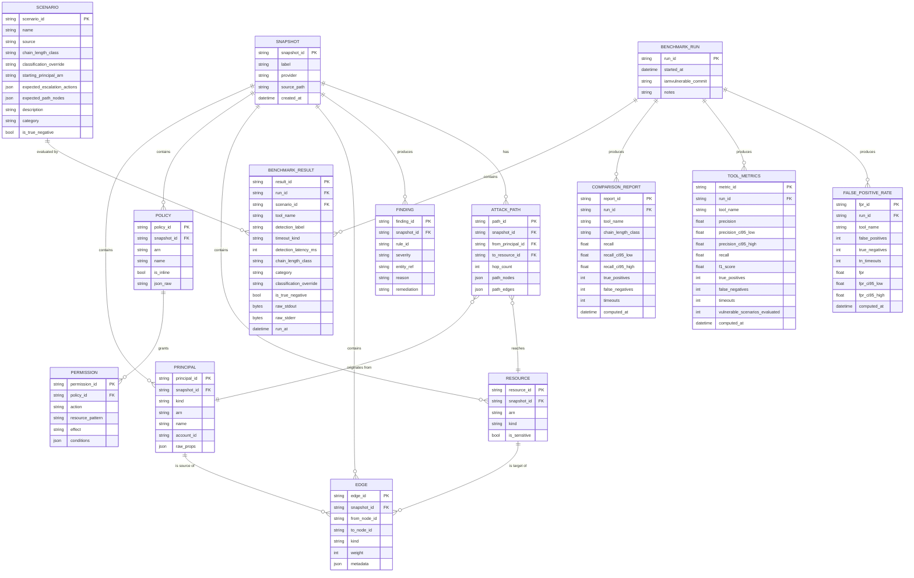
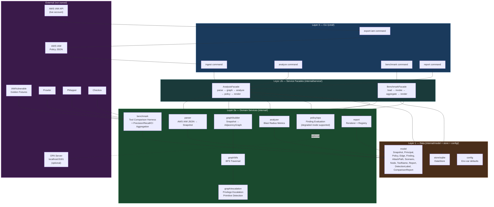

# AccessGraph Architecture

System architecture specification for AccessGraph. Governs code structure, interface contracts, and benchmark execution.

---

## Table of Contents

1. [Introduction](#1-introduction)
2. [Definitions](#2-definitions)
3. [Repository Identity](#3-repository-identity)
4. [Layer Architecture](#4-layer-architecture)
5. [ER Diagram](#5-er-diagram)
6. [IAMVulnerable Scenario Taxonomy](#6-iamvulnerable-scenario-taxonomy)
7. [Component Architecture](#7-component-architecture)
8. [Repository Structure](#8-repository-structure)
9. [Layer Contracts](#9-layer-contracts)
10. [Core Interface Contracts](#10-core-interface-contracts)
11. [External Tool Invocation Contract](#11-external-tool-invocation-contract)
12. [Data Flow — End-to-End Trace](#12-data-flow--end-to-end-trace)
13. [Testing Architecture](#13-testing-architecture)
14. [Makefile Target Specification](#14-makefile-target-specification)
15. [Planned Extensions](#15-planned-extensions)

## 1. Introduction

This document is the system architecture specification for AccessGraph. It is intended for developers, reviewers, and evaluators who need to understand the system's structure, interfaces, and design rationale. AccessGraph is a graph-based, offline-first tool for detecting IAM privilege escalation paths and quantifying blast radius in AWS environments. It is benchmarked against three open-source cloud security posture management tools — Prowler, PMapper, and Checkov — on the IAMVulnerable dataset. The document covers component architecture, layer contracts, interface specifications, the domain data model, the benchmark execution model, and the testing architecture. Two companion documents complete the specification: `benchmark_methodology.md` governs all benchmark decisions, and `findings_schema.md` governs all JSON output formats.

## 2. Definitions

The following terms are used throughout this document and its companion specifications.

**Blast radius.** The set of resources reachable from a compromised principal via breadth-first search (BFS) traversal of the permission graph, together with quantitative metrics: reachable resource count, distinct path count, percentage of environment reachable, and minimum hop depth to an admin-equivalent resource.

**Admin-equivalence.** A resource is admin-equivalent if it satisfies the criteria defined in `findings_schema.md` Section 1.1: having `arn:aws:iam::aws:policy/AdministratorAccess` attached, or any inline or managed policy granting `iam:*` on `*`, or `*:*` on `*`. That section is the single canonical definition; this document and `benchmark_methodology.md` cross-reference it rather than restating it.

**Escalation edge.** A synthetic directed edge added to the permission graph representing a privilege escalation primitive (e.g., `iam:PassRole` + `lambda:CreateFunction`). Escalation edges are not present in the raw IAM export; they are derived by `internal/graph/escalation.go` during graph construction from a hardcoded table of IAM action patterns.

**Sensitive resource.** A resource marked `is_sensitive = true` by the classification heuristics in `internal/analyzer/sensitivity.go` before graph traversal begins. The heuristics match admin-named IAM roles, `AdministratorAccess` policy Amazon Resource Names (ARNs), Secrets Manager secrets, and AWS Key Management Service (KMS) keys. Sensitive resources determine which BFS-reachable nodes are counted as high-value targets in blast-radius computation. The Open Policy Agent (OPA) rule in `policy/sensitivity.rego` independently produces Finding records for resources already marked sensitive; it does not perform the classification itself.

**True negative (TN) environment.** An IAM configuration containing no privilege escalation path, used to measure false positive rates. TN environments have `is_true_negative = true`, `chain_length_class = "none"`, and `category = "none"`. Distinct from "clean" in informal usage.

**Chain-length class.** The hop-depth classification of an escalation path: `simple` (0–1 hops), `two_hop` (2 hops), `multi_hop` (3 or more hops). In benchmark results, the class is always copied from ground-truth scenario metadata and is never derived at runtime. In analysis reports, it is derived from the `hop_count` field of each `AttackPath`.

## 3. Repository Identity

### Repository Name

**`accessgraph`**

The name matches the CLI binary (`accessgraph`), and scopes to what the tool does: graph-based access analysis.

### Scope (What This Codebase Is)

AccessGraph is a **command-line, offline-first, graph-based IAM blast-radius quantification tool**. It answers one question:

> *From a compromised principal, how far can an attacker go, by what paths, and how does that compare to what existing tools detect?*

It is a benchmarked, open-source research instrument evaluated against the IAMVulnerable dataset.

**"Offline-first" definition:** The tool makes no network calls to the public internet. The tool may make localhost calls to an OPA server (`localhost:8181`) when the policy evaluation service is running. If OPA is unavailable, the tool degrades gracefully: analysis continues without findings, and the report notes that policy evaluation was skipped. Benchmark runs always proceed regardless of OPA availability. See Section 11 for the degraded-mode specification.

### Language

**Go 1.26+**

The project uses Go 1.26+ for its native concurrency support, static binary compilation, and interface-driven testing facilities. This specification assumes Go throughout.

### Dependency Pinning

Reproducible builds require that `go build` produces the same binary regardless of when or where it runs. The following is mandatory:

- **`go.sum` is committed:** Every indirect dependency has a pinned hash in `go.sum`. `go mod verify` must pass in CI.
- **No `replace` directives** pointing to local paths in `go.mod` — these break reproducibility for any consumer outside the original machine.
- **The Docker benchmark image** is built `FROM golang:1.26-bookworm@sha256:4f4ab2c90005e7e63cb631f0b4427f05422f241622ee3ec4727cc5febbf83e34` with a pinned digest (not a floating tag). Bookworm (Debian-slim) is used instead of Alpine because Checkov's official docs explicitly warn against installing Checkov on Alpine due to incompatible C extensions, and the cost of glibc-based images for this benchmark's image-size budget is negligible. The exact digest is selected at Dockerfile authoring time and committed alongside the Dockerfile.

Vendoring (`go mod vendor`, `-mod=vendor` builds, CI vendor check) is planned but not yet implemented — see Section 15.

### Benchmark Execution Model

The benchmark runs inside a **single Docker image** that co-installs Go, Prowler (Python 3.11), PMapper, and Checkov. `benchmark.ToolConfig` is populated from environment variables set in the Dockerfile entrypoint — tool binary paths are never hardcoded. The Docker image is the canonical execution environment for `make benchmark` and `make benchmark-full`.

**Tool path environment variables:** Each `benchmark.ToolConfig` field is populated from a corresponding environment variable. The Dockerfile entrypoint must set all four:

| `benchmark.ToolConfig` field | Environment variable | Docker default |
|--------------------------|---------------------|----------------|
| `Prowler` | `ACCESSGRAPH_PROWLER_PATH` | `/opt/venv-prowler/bin/prowler` |
| `PMapper` | `ACCESSGRAPH_PMAPPER_PATH` | `/opt/venv-prowler/bin/pmapper` |
| `Checkov` | `ACCESSGRAPH_CHECKOV_PATH` | `/opt/venv-checkov/bin/checkov` |
| `IAMVulnerableDir` | `ACCESSGRAPH_IAMVULNERABLE_DIR` | `/opt/iam-vulnerable` |

`config.Load()` reads these environment variables; empty values are allowed only when the corresponding tool is not in the `--tools` flag list. `IAMVulnerableDir` is the root of the cloned IAMVulnerable repository, used by adapters to resolve tool-specific sub-paths (see Section 11).

**Python environment note:** The Docker image contains two Python 3.11 virtual environments — one for Prowler+PMapper and one for Checkov. The two venvs are isolated because Prowler 5.20.0 and Checkov 3.2.509 each pin `boto3` to an exact, incompatible version: Prowler pins `boto3==1.40.61` (and `botocore==1.40.61`), while Checkov pins `boto3==1.35.49`. These exact pins are irreconcilable in a single virtual environment, as verified empirically by attempting `pip install prowler==5.20.0 checkov==3.2.509` in a clean Python 3.11 environment, which fails at resolution. Both upstream projects intentionally pin to specific tested AWS SDK versions for reproducibility. `benchmark.ToolConfig.Prowler` and `benchmark.ToolConfig.Checkov` point to the respective venv binaries (`/opt/venv-prowler/bin/prowler` and `/opt/venv-checkov/bin/checkov`). PMapper 1.1.5 has no `boto3` pin or `pydantic` dependency and is installed into the Prowler venv via `pip install principalmapper`, exposing the `pmapper` CLI on the Prowler venv's `bin/` path; the choice of which venv hosts PMapper is a convention, not a constraint. Both tools require pydantic v2 (>=2.0,<3.0).

**Prowler version pinning rationale:** This work pins `prowler==5.20.0` (released 2026-03-12) and does not bump to newer 5.21+ releases. Prowler 5.21 introduced an "Attack Paths" feature with privilege escalation queries from the pathfinding.cloud library, but Attack Paths runs in the Prowler App API worker (with a Neo4j backend), not in the standalone `prowler aws` CLI invocation that this benchmark uses. The 5.21 release notes also describe enhanced IAM privilege escalation detection added under AWS checks, but it is unclear from public release notes whether these are CLI-level checks or App-level Neo4j queries. Pinning to 5.20.0 avoids the risk of unverified detection-logic shifts that would invalidate the captured benchmark recall numbers. A future release (v1.1) may re-run the benchmark against newer Prowler versions for comparison.

`docker-compose.yml` is for **local development only** — it starts tool containers for interactive use. `docker-compose.yml` is not the benchmark execution environment. The single-image design ensures that the tool invocation paths exercised in CI are identical to those used to produce published results.

### Data Security Posture

AccessGraph ingests IAM snapshots that contain sensitive data: account IDs, ARNs, role names, trust policy documents, and inline policy JSON. The benchmark pipeline additionally captures raw stdout and stderr from external tools, which may include credential fragments, session tokens, or environment variable dumps depending on how those tools are invoked.

The following constraints are mandatory:

**SQLite database location and permissions:**
- The default SQLite path is `accessgraph.db` in the current working directory, configurable via `ACCESSGRAPH_DB` or `--db`.
- On creation, the database file is chmod'd to `0600` (owner read/write only) by `store.New`.
- The database path is configurable via `--db` flag and `ACCESSGRAPH_DB` environment variable. The README must warn against pointing this at a shared or world-readable path.

**No sensitive data in logs or stderr:**
- `internal/` packages must not log ARNs, account IDs, policy JSON, or tool output to stderr or stdout. Only the `cmd/` layer writes to stdout, and only the formatted `model.Report` — not raw ingestion data.
- The `config.go` logger (if any) must be at `INFO` level by default. `DEBUG` level may log structural information but must not log field values from `model.Snapshot`, `model.Principal`, or `model.Policy`.

**`RawStdout` and `RawStderr` in benchmark results:**
- These fields are stored in SQLite and may contain sensitive output from Prowler, PMapper, or other tools. They must never be written to stdout by any renderer. The JSON renderer includes them only when `--include-raw` is explicitly passed.
- The `make clean` target must document that it does not delete the database — users must explicitly run `make clean-db` or delete the file manually, so the action is intentional.

**No network calls with captured data:**
- The `transport/offline.go` enforcement ensures no IAM data is transmitted to external services. This applies to OPA as well — OPA runs localhost only. If OPA is ever configured to a non-localhost address, the tool must warn at startup and require `--allow-remote-opa` to proceed.
- `transport.NewOfflineClient()` returns an `*http.Client` whose `Transport.RoundTrip` returns `ErrNonLocalhostBlocked` for any host that is not `127.0.0.1`, `localhost`, `::1`, or a bare hostname without dots (bare hostnames are allowed to support Docker Compose service names such as `opa`). This client is available for any component that needs to make external HTTP calls. The OPA evaluator (`policy.NewOPAEvaluator`) does not use an HTTP client — it loads Rego files from an `fs.FS` and evaluates policies in-process via the embedded Go OPA library. It is not set as `http.DefaultClient` — that would affect all HTTP in the process and break test frameworks.

**Fixture file sensitivity:**
- Committed fixture files in `fixtures/iamvulnerable/` must use placeholder account IDs (e.g., `123456789012`) in all JSON, not real AWS account IDs. The `make fixtures` target substitutes the real account ID at generation time from `$AWS_ACCOUNT_ID`. `make generate-checksums` must run after this substitution. This prevents leaking the benchmark AWS account ID in the public repository.


---

## 4. Layer Architecture

The three-layer dependency contract translates directly to Go. The dependency arrow **only points downward**. A layer imports only from the layer immediately below it.

```
┌─────────────────────────────────────────────────────────────────────┐
│ Layer 3: I/O Boundary │
│ cmd/accessgraph/commands/ │
│ │
│ Knows: CLI flags, stdin/stdout, file paths, exit codes. │
│ Does: Parses flags → calls one method on a facade → writes output.│
│ must not: Contain business logic. must not query the graph │
│ directly. must not orchestrate multiple service calls. │
└───────────────────────────┬─────────────────────────────────────────┘
 │ calls (via AnalysisFacade / BenchmarkFacade interfaces)
┌───────────────────────────▼─────────────────────────────────────────┐
│ Layer 2b: Service (Facade) Layer │
│ internal/service/ │
│ │
│ Knows: Pipeline orchestration order. Which services call which. │
│ Does: Sequences parser → graph → analyzer → policy → store → │
│ renderer. The only place multiple Layer 2a services touch. │
│ must not: Read CLI flags. must not format for a specific output. │
└───────────────────────────┬─────────────────────────────────────────┘
 │ calls (via interfaces)
┌───────────────────────────▼─────────────────────────────────────────┐
│ Layer 2a: Domain Services │
│ internal/parser/ internal/graph/ internal/analyzer/ │
│ internal/policy/ internal/benchmark/ internal/report/ │
│ │
│ Knows: Domain rules. IAM semantics. BFS invariants. │
│ What makes a path "privileged". What counts as a finding. │
│ Does: Graph traversal, blast radius computation, rule evaluation, │
│ benchmark orchestration, output serialization. │
│ must not: Read CLI flags. must not write to stdout. must not │
│ know it's being called from a CLI (or a test, or a job).│
└───────────────────────────┬─────────────────────────────────────────┘
 │ reads/writes (via DataStore interface)
┌───────────────────────────▼─────────────────────────────────────────┐
│ Layer 1: Data │
│ internal/model/ internal/store/ internal/config/ │
│ │
│ Knows: Schema. SQLite. Serialization shapes. Env-var defaults. │
│ Does: Define structs, persist snapshots, load snapshots, load config. │
│ must not: Enforce business rules. must not know about BFS or │
│ privilege escalation. must not know about OPA. │
└─────────────────────────────────────────────────────────────────────┘
```


---

## 5. ER Diagram

The following diagram represents the **domain model** — the entities AccessGraph reasons about. These map to Go structs in `internal/model/` and SQLite tables in `internal/store/`.



### Entity Definitions

| Entity | Role | Key Invariant |
|--------|------|---------------|
| `SNAPSHOT` | Point-in-time capture of an IAM environment | All other entities are scoped to a snapshot |
| `PRINCIPAL` | IAM User, Role, Group, or K8s ServiceAccount | `kind` is an enum: `IAMUser`, `IAMRole`, `IAMGroup`, `K8sServiceAccount` |
| `POLICY` | AWS IAM policy document | `is_inline` distinguishes managed vs inline policies |
| `PERMISSION` | A single `(action, resource, effect)` triple within a policy | Effect is always `Allow` or `Deny` |
| `RESOURCE` | An AWS resource (S3 bucket, EC2, Lambda, etc.) | `is_sensitive` marks high-value targets for path analysis |
| `EDGE` | Directed relationship between any two nodes in the graph | `kind` is an enum (see Component Architecture). `weight` is reserved for future Dijkstra-based analysis; all edges have `weight = 1` in the current implementation and BFS ignores this field. FK integrity for `from_node_id` and `to_node_id` is enforced at the application layer in `graph/builder.go`, not by SQLite constraints — edge node IDs are snapshot-scoped ARNs validated during graph construction. |
| `FINDING` | A policy violation surfaced by an OPA rule | `severity` is `LOW`, `MEDIUM`, `HIGH`, `CRITICAL` |
| `ATTACK_PATH` | A BFS-discovered path from a principal to a sensitive resource | `hop_count` is the minimum path length |
| `BENCHMARK_RUN` | One complete invocation of `accessgraph benchmark` | Groups all `BENCHMARK_RESULT` rows from a single run; stores `iamvulnerable_commit` for reproducibility |
| `SCENARIO` | One IAMVulnerable test case or true negative environment. `scenario_id` is the canonical primary key (Terraform directory name for vulnerable scenarios, `tn-clean-NNN` for TN environments); see `benchmark_methodology.md` Section 4.2 for the authoritative field-level specification and Section 6 of this document for category and chain-length-class semantics. |
| `BENCHMARK_RESULT` | One tool's detection result for one scenario in one run | `detection_label` is a `DetectionLabel` enum: `TP`, `FP`, `FN`, `TN`, or `TIMEOUT` — never three independent booleans |
| `COMPARISON_REPORT` | Per-class recall and CI for one tool across one chain_length_class | Scoped to a `run_id`; per-class precision is not stored here — FP is tool-level, not class-scoped |
| `TOOL_METRICS` | Tool-level aggregated precision, recall, F1, and confidence intervals across all chain-length classes. Derived from COMPARISON_REPORT and FALSE_POSITIVE_RATE rows per the formulas in `benchmark_methodology.md` Section 6; stored for query convenience. |
| `FALSE_POSITIVE_RATE` | False positive rate (FPR) per tool computed from true negative environments | Tool-level only; TN environments are not class-scoped; `FalsePositives + TrueNegatives + Timeouts` equals the total TN environments evaluated |

### Unpersisted Model Types (in-memory only)

These types appear in interface signatures and service return values but are not stored in SQLite. They are defined in `internal/model/` alongside persisted types.

| Type | Definition | Used By |
|------|-----------|---------|
| `model.Node` | A graph vertex — either a Principal or Resource — with its ARN, kind, and snapshot-scoped ID | Used internally by `graph/bfs.go` during traversal; returned by the unexported `neighbors()` method on `*Engine`. Defined in `model/` rather than as an unexported type in `graph/` because `AttackPath.path_nodes` references node ARNs and a shared vertex type ensures consistent identity semantics across graph construction and path serialization. |
| `model.ToolName` | Typed string constant for benchmark tool identity: `ToolAccessGraph`, `ToolProwler`, `ToolPMapper`, `ToolCheckov` | `Runner.RunTool`, benchmark runner registry |
| `model.Report` | Unified output envelope wrapping `BlastRadiusReport`, `[]*Finding`, and optionally `*ComparisonReport` | `Renderer` interface — all render implementations take this type |
| `model.DetectionLabel` | Typed string constant: `LabelTP`, `LabelFP`, `LabelFN`, `LabelTN`, `LabelTimeout` | `BenchmarkResult.DetectionLabel` — replaces the three-boolean schema |
| `model.ChainLengthClass` | Typed string constant for scenario class: `ClassSimple`, `ClassTwoHop`, `ClassMultiHop`, `ClassNone` | `BenchmarkResult.ChainLengthClass`, `AttackPath.ChainLengthClass` — never a raw string. `ClassNone` is used only for TN environments; the aggregator must skip `ClassNone` rows when computing per-class recall. |
| `model.ScenarioCategory` | Typed string constant for IAMVulnerable category: `CategoryDirectPolicy`, `CategoryCredentialManipulation`, `CategoryRoleTrust`, `CategoryPassRoleChain`, `CategoryServiceAbuse`, `CategoryNone` | `BenchmarkResult.Category`, `Scenario.Category` — never a raw string. `CategoryNone` is used only for TN environments. |

**JSON serialization contract:** All model structs use `json:"snake_case"` tags on every exported field, where the tag value matches the field name in `findings_schema.md` exactly. For example, `TruePositives int` is tagged `json:"true_positives"`, `RecallCI95Low float64` is tagged `json:"recall_ci95_low"`, and `FalsePositiveRate.Timeouts int` is tagged `json:"tn_timeouts"` (matching the schema's `tn_timeouts` key, not the Go field name). Two independent implementations must produce byte-identical JSON for the same input data. The JSON renderer verifies this by round-tripping through `json.Marshal` → `json.Unmarshal` in adapter tests.

**Float serialization:** All float fields (recall, precision, F1, CI bounds, FPR, `pct_environment_reachable`) are serialized using a custom `json.Marshaler` that calls `fmt.Sprintf("%.6f", v)`, producing exactly six decimal places with trailing zeros (e.g., `1.000000`, `0.909091`, `0.000000`). Go's default `json.Marshal` for float64 uses minimal representation (`strconv.FormatFloat`), which would produce `1` instead of `1.000000` and violates the byte-identical output contract across implementations. The custom marshaler is defined as a `type MetricFloat float64` wrapper in `internal/model/benchmark.go` and used on all float fields in `ClassMetrics`, `ToolMetrics`, `FalsePositiveRate`, and `BlastRadiusReport`.

**`pct_environment_reachable` is stored and serialized as a percentage value** (e.g., `27.300000` means 27.3% of resources are reachable), not as a proportion in [0,1]. The computation is `(ReachableResourceCount / TotalResourceCount) * 100`. The `MetricFloat` wrapper applies: the JSON output is `27.300000`, not `0.273000`.

Wilson score CI bounds are rounded to six decimal places *after* clamping to [0, 1]. Clamping: set `low = max(0.0, low)` and `high = min(1.0, high)` before rounding. After clamping and rounding, the invariant `0 <= low <= p_hat <= high <= 1` must hold; if it does not, the implementation must terminate with an assertion failure (this indicates a formula bug, not a data condition).


---

## 6. IAMVulnerable Scenario Taxonomy

### Version Pinning

IAMVulnerable is an open-source project whose scenario count and path definitions may change between commits. All benchmarks must be run against a fixed, recorded commit.

**Required:** `fixtures/iamvulnerable/COMMIT` must contain the exact git SHA of the IAMVulnerable commit used to generate the fixture snapshots. `BENCHMARK_RUN.iamvulnerable_commit` must be populated with this SHA at the start of every benchmark run. Any reproduction attempt that uses a different commit produces incomparable results.

### Vulnerable Scenario Taxonomy

IAMVulnerable's 31 paths fall into five categories. Every `SCENARIO` row with `is_true_negative = false` must have its `category` field set to one of these exact string values, and its `chain_length_class` derived from the mapping below.

| Category | `category` value | Escalation Mechanism | `chain_length_class` |
|----------|-----------------|---------------------|----------------------|
| Direct IAM policy manipulation | `direct_policy` | `iam:CreatePolicyVersion`, `iam:SetDefaultPolicyVersion`, `iam:AttachUserPolicy/GroupPolicy/RolePolicy`, `iam:PutUserPolicy/GroupPolicy/RolePolicy` | `simple` |
| User and credential manipulation | `credential_manipulation` | `iam:CreateAccessKey`, `iam:CreateLoginProfile`, `iam:UpdateLoginProfile`, `iam:AddUserToGroup` | `simple` |
| Role trust manipulation | `role_trust` | `iam:UpdateAssumeRolePolicy` + `sts:AssumeRole` | `two_hop` |
| PassRole combinations | `passrole_chain` | `iam:PassRole` + `ec2:RunInstances`, `lambda:CreateFunction` + `lambda:InvokeFunction`, `lambda:CreateFunction` + `lambda:CreateEventSourceMapping`, `cloudformation:CreateStack`, `datapipeline:CreatePipeline`, `glue:CreateDevEndpoint` | `multi_hop` |
| Service abuse | `service_abuse` | `lambda:UpdateFunctionCode`, `glue:UpdateDevEndpoint`, transitive multi-hop role assumption chains | `multi_hop` |

**`chain_length_class` definition:**

| Class | Hop count | Meaning |
|-------|-----------|---------|
| `simple` | 0–1 | Single permission grants escalation directly (a principal that already holds admin-equivalent access has hop_count 0) |
| `two_hop` | 2 | Two permissions required in sequence |
| `multi_hop` | 3+ | Three or more permissions chained; requires graph traversal to detect |

**Admin-equivalence definition:** See `findings_schema.md` Section 1.1 for the single authoritative definition. Do not restate it here — `findings_schema.md` Section 1.1 is the canonical source referenced by both this document and `benchmark_methodology.md`.

**Edge case note on `direct_policy`:** Several actions in this category require chaining. For example, `iam:SetDefaultPolicyVersion` only grants escalation when the attacker also holds `iam:CreatePolicyVersion`. Whether this is classified as `simple` or `two_hop` depends on how the graph models policy version creation as a distinct hop. The exact classification for each IAMVulnerable scenario, including these edge cases, must be documented in `docs/benchmark_methodology.md` before any precision/recall results are published.

### True Negative Environments

To compute Specificity and False Positive Rate, and to prevent tools from trivially achieving 100% recall by flagging everything, the benchmark suite must include clean IAM environments with no escalation path. These are `SCENARIO` rows with `is_true_negative = true`. Their `starting_principal_arn`, `expected_escalation_actions`, and `expected_path_nodes` are empty. Their `chain_length_class` is `none` (`model.ClassNone`) and their `category` is `none` (`model.CategoryNone`). A tool output for a TN scenario that produces any escalation-path finding is scored `LabelFP`. A tool output that produces no finding is scored `LabelTN`.

TN environment `scenario_id` values use the format `tn-clean-NNN` (e.g., `tn-clean-001` through `tn-clean-010`). Fixture directories match this identifier: `fixtures/iamvulnerable/tn-clean-001/`, etc.

**`chain_length_class` in `BenchmarkResult` is always copied from the scenario fixture's ground-truth class** — it is never derived from `hop_count` at runtime. The hop-count derivation rule (simple/two_hop/multi_hop from hop_count) applies only to `AttackPath` objects produced during analysis reports. This distinction prevents silent miscounting in the per-class recall table when AccessGraph's BFS discovers a path whose hop count differs from the taxonomy-assigned class.

Precision/recall is computed separately for each `chain_length_class`. A tool that achieves 100% recall on `simple` paths but 0% on `multi_hop` paths is a compliance scanner limited to single-hop detection — this distinction is the primary research finding of this work.

### Admin-Equivalent Policies as Resource Nodes

The permission graph models IAM entities in three node types: Principals (users, roles, groups), Policies (managed and inline), and Resources (targets of non-wildcard permissions). Most IAMVulnerable scenarios grant wildcard permissions (`Resource: "*"`), which means the parser creates no Resource nodes for those permissions. Privilege escalation in these scenarios terminates at an admin-equivalent policy (the shared `privesc-sre-admin-policy` or, in the canonical case, `AdministratorAccess`).

The benchmark's detection matcher (`classifyDetectionInternal`) determines TP by checking whether any BFS attack path terminates at a node whose ARN matches the terminal element of `expected_attack_path`. It performs this lookup against `snapshot.Resources` only, since Resources are the graph's representation of reachable targets. Without special handling, paths that terminate at a Policy node (rather than a Resource node) are invisible to the matcher, and every wildcard-permission scenario produces FN regardless of whether AccessGraph correctly discovered the escalation chain.

To close this gap, the parser also creates a Resource node for any policy that satisfies the admin-equivalence criteria defined in `findings_schema.md` Section 1.1. The Resource node carries the policy's ARN and is marked `IsSensitive = true` by the sensitivity classifier. This allows the BFS to record an attack path terminating at the policy-as-resource, and the matcher to find the path by its ARN.

The rationale: attaching an admin-equivalent policy to a principal confers administrative access. From a blast-radius perspective, the policy is a reachable sensitive target in the same way that an S3 bucket holding secrets or a KMS key is a reachable sensitive target. The IAM-Deescalate paper and PMapper both model escalation paths as terminating at the admin policy; `benchmark_methodology.md` Section 4.1's ground-truth example uses `arn:aws:iam::aws:policy/AdministratorAccess` as the terminal element of `expected_path_nodes`. Modeling admin-equivalent policies as Resources aligns AccessGraph's internal representation with the benchmark's ground truth and with the other tools it is compared against.

This design does not affect non-benchmark usage. The analysis report's blast-radius metrics (`reachable_resource_count`, `pct_environment_reachable`) include admin-equivalent policy nodes in the resource count, which is the correct behavior: an attacker who reaches AdministratorAccess has reached the most sensitive target in the environment.

---

## 7. Component Architecture



### Edge Kind Taxonomy

Every edge in the graph has a typed `kind`. This is the vocabulary of the permission graph.

| Edge Kind | From → To | Meaning |
|-----------|-----------|---------|
| `ATTACHED_POLICY` | Principal → Policy | Role/User has this managed policy attached |
| `INLINE_POLICY` | Principal → Policy | Role/User has this inline policy |
| `ASSUMES_ROLE` | Principal → Principal | Trust policy allows this assumption |
| `TRUSTS_CROSS_ACCOUNT` | Principal → Account | Cross-account trust relationship |
| `ALLOWS_ACTION` | Policy → Permission | Policy grants this action |
| `APPLIES_TO` | Permission → Resource | Permission targets this resource |
| `MEMBER_OF` | Principal → Principal | IAM User belongs to this Group |
| `CAN_PASS_ROLE` | Principal → Principal | `iam:PassRole` privilege chain |
| `CAN_CREATE_KEY` | Principal → Principal | `iam:CreateAccessKey` privilege chain |


---

## 8. Repository Structure

```
accessgraph/
│
├── cmd/ ← Layer 3: I/O boundary (CLI commands only)
│ └── accessgraph/
│ ├── main.go ← Entry point: wires dependencies, starts Cobra
│ └── commands/
│ ├── root.go ← Root Cobra command and global flags
│ ├── ingest.go ← `accessgraph ingest` — parse + store snapshot
│ ├── analyze.go ← `accessgraph analyze` — blast radius report
│ ├── benchmark.go ← `accessgraph benchmark` — run tool comparisons
│ └── report.go ← `accessgraph report` — format and emit findings
│
├── internal/ ← Layer 2: Domain services (business logic)
│ │
│ ├── model/ ← Layer 1: Domain types (structs, no logic)
│ │ ├── snapshot.go ← Snapshot, Principal, Policy, Permission, Resource
│ │ ├── graph.go ← Node, Edge, EdgeKind (typed constants)
│ │ ├── finding.go ← Finding, Severity (typed constants)
│ │ ├── attack_path.go ← AttackPath, BlastRadiusReport
│ │ └── benchmark.go ← Scenario, BenchmarkResult, DetectionLabel, ComparisonReport
│ │
│ ├── parser/ ← Layer 2: Ingestion (stateless transformation)
│ │ ├── parser.go ← Parser interface
│ │ └── aws_iam.go ← AWSIAMParser implementation: AWS IAM JSON → model.Snapshot
│ │
│ ├── graph/ ← Layer 2: Graph construction and traversal
│ │ ├── engine.go ← Traverser interface
│ │ ├── builder.go ← Snapshot → adjacency graph
│ │ ├── bfs.go ← BFS traversal, hop tracking, path collection
│ │ └── escalation.go ← Privilege escalation primitive detection
│ │
│ ├── analyzer/ ← Layer 2: Blast radius computation (core research)
│ │ ├── analyzer.go ← BlastRadiusAnalyzer interface
│ │ ├── blast_radius.go ← Metrics: reachability, hop count, path count
│ │ └── sensitivity.go ← Sensitivity classification of resources
│ │
│ ├── policy/ ← Layer 2: OPA rule evaluation
│ │ ├── evaluator.go ← FindingEvaluator interface
│ │ └── opa.go ← Embedded OPA evaluator (loads local Rego files via os.DirFS); supports degraded mode
│ │
│ ├── benchmark/ ← Layer 2: Tool comparison harness
│ │ ├── adapter.go ← ToolAdapter interface (Invoke + Parse)
│ │ ├── adapters_export.go ← Exported adapter constructors for integration tests (build tag: integration)
│ │ ├── runner.go ← ToolConfig struct, runner struct, RunTool dispatch entry point
│ │ ├── registry.go ← ScenarioRunner interface, toolScenarioRunner shim, NewScenarioRegistry
│ │ ├── pipeline.go ← RunBenchmark pipeline, runAccessGraphOnScenario, ParseToolList
│ │ ├── dispatch_integration.go ← adapterRegistry map + dispatch() method (build tag: integration)
│ │ ├── dispatch_stub.go ← dispatch() stub returning ErrToolFailed (non-integration builds)
│ │ ├── iamvulnerable.go ← IAMVulnerable scenario loader (31 scenarios + TN environments, 5 categories)
│ │ ├── aggregator.go ← Precision/recall/CI aggregation per tool per chain_length_class
│ │ ├── accessgraph_test.go ← Tests for AccessGraph self-evaluation (lives in internal/, not tests/)
│ │ ├── prowler.go ← Prowler adapter: invocation + output normalization
│ │ ├── pmapper.go ← PMapper adapter: invocation + output normalization
│ │ └── checkov.go ← Checkov adapter: invocation + output normalization
│ │
│ ├── report/ ← Layer 2: Output formatting (I/O-blind)
│ │ ├── renderer.go ← Renderer interface + RendererRegistry
│ │ ├── reporter.go ← Reporter interface + DefaultReporter
│ │ ├── terminal.go ← Colored terminal output (implements Renderer)
│ │ ├── json.go ← JSON serialization (implements Renderer)
│ │ └── graphviz.go ← DOT language graph export (implements Renderer)
│ │
│ ├── service/ ← Layer 2: Facade implementations (pipeline orchestration)
│ │ ├── facade.go ← AnalysisFacade + BenchmarkFacade interfaces and analysisFacade implementation
│ │ ├── analysis.go ← RunAnalysis free function: load → graph → analyze → policy → store → report
│ │ ├── benchmark.go ← benchmarkFacade implementation: load → invoke → aggregate → store → report
│ │ ├── benchmark_run.go ← RunBenchmark entry point (benchmark Dependency Inversion (DI) wiring)
│ │ ├── ingest.go ← RunIngest: parse → classify → store
│ │ ├── report.go ← RunReport: load → reconstruct → render
│ │ └── util.go ← Shared service utilities (ResolvePrincipalByARN)
│ │
│ ├── store/ ← Layer 1/2 boundary: Persistence
│ │ ├── store.go ← DataStore interface
│ │ ├── sqlite.go ← SQLite implementation
│ │ ├── schema.go ← SQLite schema Data Definition Language (DDL)
│ │ └── memory.go ← In-memory implementation (for tests only)
│ │
│ ├── config/ ← Layer 1: Configuration structs and defaults
│ │ └── config.go
│ │
│ └── transport/ ← HTTP transport with offline enforcement
│ └── offline.go
│
├── policy/ ← OPA Rego rules (data, not code)
│ ├── iam_wildcard.rego
│ ├── cross_account_trust.rego
│ ├── privilege_escalation.rego
│ └── sensitivity.rego
│
├── sample/ ← Sample IAM policy JSON for demos and tests
│ ├── aws/
│ │ └── demo_policy.json
│ └── terraform/ ← (see Section 15)
│
├── fixtures/ ← (see Section 15)
│ ├── iamvulnerable/
│ │ ├── COMMIT ← Exact IAMVulnerable git commit SHA used to generate these fixtures
│ │ ├── vulnerable/ ← 31 scenario environment snapshots (JSON)
│ │ └── clean/ ← TN environment snapshots: IAM configurations with no escalation path
│ └── tool_outputs/ ← Canonical raw tool outputs for offline adapter testing
│ ├── prowler/
│ ├── pmapper/
│ └── checkov/
│
├── tests/ ← All test files (mirrors internal/ structure)
│ ├── parser/
│ │ └── aws_iam_test.go
│ ├── graph/
│ │ ├── bfs_test.go
│ │ ├── bfs_property_test.go ← Property-based BFS tests (pgregory.net/rapid)
│ │ └── escalation_test.go
│ ├── analyzer/
│ │ └── blast_radius_test.go
│ ├── policy/
│ │ └── opa_test.go ← Uses httptest server; does not require a running OPA instance
│ ├── benchmark/
│ │ ├── aggregator_test.go ← Precision/recall/CI correctness on known TP/FP/FN/TN sets
│ │ ├── adapter_test.go ← Adapter Parse() correctness against golden tool output fixtures
│ │ └── iamvulnerable_test.go ← IAMVulnerable scenario tests (//go:build integration)
│ ├── store/
│ │ └── sqlite_test.go
│ ├── service/
│ │ └── analysis_test.go
│ ├── report/
│ │ └── reporter_test.go ← Reporter rendering tests
│ ├── schema/
│ │ └── invariants_test.go ← Schema invariant tests
│ └── integration/
│ └── pipeline_test.go ← End-to-end: parse → graph → analyze → report (//go:build integration)
│
├── docs/
│ ├── ARCHITECTURE.md ← This file (copy here after updates)
│ ├── benchmark_methodology.md ← REQUIRED before publishing results
│ └── findings_schema.md ← JSON schema for findings output
│
├── scripts/
│ ├── audit.sh ← Architectural fitness checks (layer deps, interfaces, MetricFloat, JSON tags)
│ └── run_iamvulnerable.sh ← Automates benchmark against all scenarios
│
├── Dockerfile ← Single benchmark image: Go + Python 3.11 (two venvs)
├── docker-compose.yml ← (see Section 15)
├── requirements-prowler.txt ← Pinned Python deps for Prowler venv (prowler==5.20.0, principalmapper==1.1.5)
├── requirements-checkov.txt ← Pinned Python deps for Checkov venv (checkov==3.2.509)
├── .github/
│ └── workflows/
│ └── ci.yml ← Build, test (≥75% coverage, core packages ≥80%), lint, sec scan, race detector
│
├── CHANGELOG.md
├── LICENSE
├── .gitignore
├── .golangci.yml
├── go.mod
├── go.sum
├── Makefile
└── README.md
```


---

## 9. Layer Contracts

The following are **mandatory** rules for every package.

### Layer 1 — `internal/model/`, `internal/store/`, and `internal/config/`

**Concurrency contract for `memory.Store`:** `memory.Store` protects all map reads and writes with a `sync.RWMutex`. Read methods (`LoadSnapshot`, `LoadFindings`, `LoadBenchmarkResults`, etc.) acquire `RLock`. Write methods (`SaveSnapshot`, `SaveFindings`, etc.) acquire `Lock`. The mutex is required because `go test -race ./...` is a CI gate and parallel table-driven tests read and write the same store instance concurrently.

**Concurrency contract for `sqlite.Store`:** `sqlite.Store` opens a single database connection with Write-Ahead Logging (WAL) journal mode enabled via `PRAGMA journal_mode = WAL` executed after opening the connection. It is not safe for concurrent use from multiple goroutines; the benchmark's sequential execution model (one scenario at a time, one tool at a time) means this is never required. If parallel benchmark execution is ever added, the connection pool and WAL configuration must be revisited. Unit tests must use `memory.Store`, not `sqlite.Store`, to avoid this constraint. Integration tests (`//go:build integration`) may use `sqlite.Store` directly for Liskov Substitution Principle (LSP) verification — confirming that `memory.Store` and `sqlite.Store` produce identical results for the same input (see `tests/store/sqlite_integration_test.go`). Integration tests that use `sqlite.Store` must not call `t.Parallel()` on subtests that share the same store instance. The race detector CI gate will catch violations, but the prohibition should be enforced by code review rather than relying on CI discovery.

**Allowed:**
- Define Go structs for all domain entities
- Define typed constants (`EdgeKind`, `Severity`, `PrincipalKind`, `DetectionLabel`)
- Implement `DataStore` interface in `internal/store/sqlite.go`
- Implement in-memory `DataStore` in `internal/store/memory.go` (test use only)
- Serialize/deserialize structs to/from SQLite rows

**Forbidden:**
- Any import from `internal/graph/`, `internal/analyzer/`, `internal/policy/`, `internal/benchmark/`, `internal/report/`, `internal/service/`
- Any import from `cmd/`
- Business logic of any kind (no BFS, no rule evaluation, no metric computation)
- Logging to stdout/stderr (use returned errors)

### Layer 2a — `internal/parser/`, `internal/graph/`, `internal/analyzer/`, `internal/policy/`, `internal/benchmark/`, `internal/report/`

**Allowed:**
- Import from `internal/model/` and `internal/store/` (via `DataStore` interface)
- Accept plain Go values as parameters (strings, structs from `model/`)
- Return domain objects (`*model.AttackPath`, `[]*model.Finding`, etc.)
- Return typed errors (`ErrNotFound`, `ErrPermission`, `ErrInvalidInput`)
- Write to `io.Writer` if passed one explicitly (for `report/` package)
- Make HTTP calls to localhost (OPA) via the `transport/` package
- **Exception for `internal/benchmark/`:** Import Layer 2a *interfaces* (not concrete types) from `internal/parser/`, `internal/graph/`, and `internal/analyzer/` because the AccessGraph adapter (Pattern C) must replicate the analysis pipeline in-process. These imports are via interfaces injected through `newRegistry`, not direct concrete-type dependencies.

**Forbidden:**
- Reading `os.Args`, `os.Stdin`, `os.Stdout` directly — those belong in `cmd/`
- Calling `os.Exit()` — return errors; the CLI layer handles exit codes
- Importing `cobra`, `kingpin`, or any CLI framework
- Importing from `cmd/` or `internal/service/`
- Using `fmt.Println` for normal output — services return data, not printed strings

### Layer 2b — `internal/service/`

**Allowed:**
- Import from any Layer 2a package (via its interface)
- Import from `internal/store/` (via `DataStore` interface)
- Import from `internal/model/`
- Implement `AnalysisFacade` and `BenchmarkFacade` interfaces
- Sequence multiple Layer 2a calls in the correct pipeline order

**Forbidden:**
- Importing from `cmd/`
- Reading `os.Args`, `os.Stdin`, `os.Stdout` directly
- Calling `os.Exit()`
- Containing output formatting logic (that belongs in `internal/report/`)
- Instantiating concrete types from Layer 2a packages (receive them injected via interfaces)

### Layer 3 — `cmd/accessgraph/commands/`

**Allowed:**
- Import from `internal/service/` (via `AnalysisFacade` / `BenchmarkFacade` interfaces only)
- Read `cobra.Command` flags and arguments
- Read environment variables for configuration
- Call **exactly one** method on a facade per command's `RunE`
- Map service errors to exit codes
- Write formatted output to `cmd.OutOrStdout()` (not `fmt.Print` directly)

**Forbidden:**
- Containing any business logic
- Importing from any Layer 2a package (`internal/graph/`, `internal/analyzer/`, `internal/report/`, etc.) directly
- More than one service call per `RunE` function
- Calling graph traversal, BFS, or OPA directly


---

## 10. Core Interface Contracts

All service packages are accessed through interfaces. Interface-based access enables:
- Testing with mocks (no real SQLite, no real OPA, no real external tools needed)
- Swapping implementations without touching callers (Open/Closed principle)

### 10.1 DataStore

```go
// DataStore is the persistence interface for all AccessGraph domain entities.
// Implementations: sqlite.Store (production), memory.Store (tests).
//
// All methods return ErrNotFound if the requested entity does not exist.
// ErrInvalidInput is returned when a required argument is empty.
type DataStore interface {
 BenchmarkResultReader // explicit embed — any DataStore satisfies BenchmarkResultReader

 SaveSnapshot(ctx context.Context, s *model.Snapshot) error
 LoadSnapshot(ctx context.Context, id string) (*model.Snapshot, error)
 LoadSnapshotByLabel(ctx context.Context, label string) (*model.Snapshot, error)
 ListSnapshots(ctx context.Context) ([]*model.Snapshot, error)

 SaveFindings(ctx context.Context, findings []*model.Finding) error
 LoadFindings(ctx context.Context, snapshotID string) ([]*model.Finding, error)

 SaveAttackPaths(ctx context.Context, paths []*model.AttackPath) error
 LoadAttackPaths(ctx context.Context, snapshotID string) ([]*model.AttackPath, error)

 SaveBenchmarkResult(ctx context.Context, r *model.BenchmarkResult) error

 SaveScenario(ctx context.Context, s *model.Scenario) error
 LoadScenario(ctx context.Context, id string) (*model.Scenario, error)
 ListScenarios(ctx context.Context) ([]*model.Scenario, error)

 // Aggregated benchmark result persistence.
 SaveClassMetrics(ctx context.Context, runID string, tool model.ToolName, class model.ChainLengthClass, m *model.ClassMetrics) error
 LoadClassMetrics(ctx context.Context, runID string) (map[model.ToolName]map[model.ChainLengthClass]*model.ClassMetrics, error)

 SaveToolMetrics(ctx context.Context, runID string, tool model.ToolName, m *model.ToolMetrics) error
 LoadToolMetrics(ctx context.Context, runID string) (map[model.ToolName]*model.ToolMetrics, error)

 SaveFalsePositiveRate(ctx context.Context, runID string, tool model.ToolName, fpr *model.FalsePositiveRate) error
 LoadFalsePositiveRates(ctx context.Context, runID string) (map[model.ToolName]*model.FalsePositiveRate, error)

 // Close releases all resources held by the store.
 Close() error
}
```

### 10.2 Parser

```go
// Parser is the ingestion interface for cloud IAM environment exports.
// Each method corresponds to exactly one source format. The returned Snapshot
// is ready to be persisted to the DataStore or passed directly to a Traverser.
type Parser interface {
 // ParseAWSIAM parses an AWS IAM environment JSON export and returns a
 // Snapshot populated with all principals, policies, permissions, resources,
 // and edges derived from the input document.
 ParseAWSIAM(ctx context.Context, data []byte, label string) (*model.Snapshot, error)

 // ParseTerraformPlan parses a Terraform plan JSON export into a Snapshot.
 // Returns ErrNotImplemented in the current AWSIAMParser concrete type.
 ParseTerraformPlan(ctx context.Context, data []byte, label string) (*model.Snapshot, error)
}
```

The concrete `AWSIAMParser` type satisfies the unified `Parser` interface. `ParseTerraformPlan` returns `ErrNotImplemented` — it exists to define the contract for future Terraform support without requiring a separate interface or implementation.

### 10.3 Traverser

**Concurrency contract:** A `Traverser` is built from a single `Snapshot` and its internal adjacency representation is read-only after construction. All five methods — `BFS`, `Neighbors`, `ShortestPath`, `NodeCount`, `EdgeCount` — are safe to call concurrently from multiple goroutines without external synchronization. Implementations must not hold mutable state that is written during query execution. This guarantee must be documented on the concrete type with a `// Safe for concurrent use.` comment and verified by a race-detector test (`go test -race`).

**Computational complexity.** BFS traversal runs in O(V + E) time where V is the number of nodes (principals + resources) and E is the number of edges (permissions + escalation primitives) in the permission graph. For a typical AWS IAM environment with N principals, the graph contains O(N × P) edges where P is the average number of policy statements per principal. <!-- TODO: Add Go testing.B benchmarks to validate wall-clock performance at scale; no benchmarks exist yet. -->

```go
// Traverser defines the read-only traversal surface of the permission graph.
// A Traverser is built from a single Snapshot via NewEngine and is not
// mutated afterward. All methods are safe for concurrent use once constructed.
type Traverser interface {
 // BFS returns all attack paths reachable from fromPrincipalID within
 // maxHops steps. Only paths that terminate at a sensitive resource
 // (IsSensitive == true) are included. Paths are sorted by HopCount ascending.
 // Returns ErrNotFound if fromPrincipalID does not exist in the graph.
 // Returns ErrInvalidInput if maxHops < 1.
 BFS(ctx context.Context, fromPrincipalID string, maxHops int) ([]*model.AttackPath, error)

 // Neighbors returns all nodes directly reachable from nodeID via a single
 // outbound edge whose Kind is in edgeKinds. An empty edgeKinds slice means
 // all edge kinds are accepted.
 // Returns ErrNotFound if nodeID does not exist in the graph.
 Neighbors(ctx context.Context, nodeID string, edgeKinds []model.EdgeKind) ([]*model.Node, error)

 // ShortestPath returns the minimum-hop path between two nodes using BFS.
 // Parameters are generic from/to node IDs — no principal→resource direction
 // is enforced.
 // Returns ErrNoPath if no path exists within maxHops.
 // Returns ErrNotFound if either from or to does not exist in the graph.
 ShortestPath(ctx context.Context, from, to string, maxHops int) (*model.AttackPath, error)

 // NodeCount returns the total number of nodes in the graph.
 NodeCount() int

 // EdgeCount returns the total number of edges in the graph.
 EdgeCount() int
}
```

### 10.4 BlastRadiusAnalyzer

```go
// BlastRadiusAnalyzer computes blast radius metrics for a given principal.
// It depends on a Traverser; it does not build graphs itself.
//
// Note: the engine parameter uses a local Traverser interface (defined in
// internal/analyzer/analyzer.go) that mirrors the subset of graph.Traverser
// required here (BFS, NodeCount). This avoids an import cycle between
// internal/analyzer and internal/graph.
type BlastRadiusAnalyzer interface {
 // Analyze computes the full blast radius report for principalID.
 // This includes reachable resource count, minimum hop to admin,
 // total distinct escalation paths, and classified path list.
 //
 // maxHops controls the BFS depth limit. The default for IAMVulnerable
 // parity is 8. AnalysisFacade.Run passes the --max-hops flag value
 // through to this parameter.
 //
 // Errors:
 // - ErrNotFound: principalID does not exist in the graph
 // - ErrInvalidInput: maxHops < 1 or principalID is empty
 Analyze(ctx context.Context, engine Traverser, snapshotID string, principalID string, maxHops int) (*model.BlastRadiusReport, error)
}
```

### 10.5 FindingEvaluator

```go
// FindingEvaluator evaluates OPA rules against a snapshot and returns findings.
// The OPA server must be running at the configured URL.
// Returns ErrOPAUnavailable if the server cannot be reached — callers must
// treat this as a degraded-mode signal, not a fatal error.
type FindingEvaluator interface {
 Evaluate(ctx context.Context, snapshot *model.Snapshot) ([]*model.Finding, error)
}
```

### 10.6 Runner

```go
// Runner executes one tool against one IAMVulnerable scenario
// and returns a structured result for comparison analysis.
//
// Each tool (AccessGraph, Prowler, PMapper, Checkov)
// has its own implementation. Tool selection is done via a registry map, not
// a switch statement. The registry pattern avoids a brittle switch and makes
// adding a new tool a single-file change with no modification to existing code.
//
// Three execution patterns exist:
//
// Pattern A — Single-command tools (Prowler, Checkov):
// Implement RunTool by delegating to baseRunner.runScenario, passing self as
// the outputAdapter. runScenario owns timeout enforcement, subprocess execution,
// and stdout/stderr capture. The concrete runner supplies only buildCmd and parse.
//
// Pattern B — Multi-command tools (PMapper):
// Implement RunTool directly, owning their own multi-step invocation loop.
// They call baseRunner.invokeWithTimeout per-subprocess to reuse timeout
// enforcement and output capture without duplicating logic. They do NOT
// implement outputAdapter because buildCmd (returning a single *exec.Cmd)
// cannot express a multi-step sequence.
// - PMapper: calls invokeWithTimeout twice (graph create, then query).
//
// Pattern C — In-process tool (AccessGraph):
// Implements RunTool directly by calling the analysis pipeline in-process
// (parse → build → BFS → score). It does NOT use baseRunner, runScenario,
// or outputAdapter — there is no subprocess. This proves the Runner
// interface does not leak external-process assumptions.
//
// Timeout return contract: when an external tool exceeds its deadline,
// invokeWithTimeout returns ErrToolTimeout. Pattern A tools have this absorbed
// by runScenario; Pattern B tools absorb it in their own RunTool loop. RunTool
// therefore always returns (non-nil result, nil) for timeouts — ErrToolTimeout
// is never propagated to RunTool callers. The only errors RunTool returns are
// ErrToolNotFound (binary missing, external tools only) and wrapped
// infrastructure errors from exec.Command.Start() itself.
type Runner interface {
 // RunTool invokes this runner's tool against the given scenario and returns
 // its raw output and detection label.
 //
 // The scenario parameter provides all ground-truth fields needed for detection
 // matching: StartingPrincipalARN (for ARN matching), ExpectedEscalationActions
 // (for mechanism matching), and the scenario metadata (Name, Category,
 // ChainLengthClass, ClassificationOverride, IsTrueNegative).
 //
 // Each adapter resolves its own tool-specific input path from the scenario:
 // - Checkov: filepath.Join(cfg.IAMVulnerableDir, scenario.Source) to get
 // the Terraform module directory
 // - All other tools: run against the live AWS account; scenario.Source is
 // used only for logging and fixture loading
 //
 // Parameters:
 //   - ctx: context for timeout and cancellation.
 //   - tool: the tool to invoke (must not be ToolNameAccessGraph).
 //   - scenarioDir: path to the directory containing the scenario's policy JSON files.
 //   - scenario: the scenario being evaluated, used for ground-truth comparison.
 //
 // Implementations must:
 // - Pattern A tools: delegate to baseRunner.runScenario, passing
 // self as outputAdapter
 // - Pattern B tools: implement RunTool directly, calling
 // baseRunner.invokeWithTimeout per-subprocess invocation
 // - Pattern C (accessgraphRunner): call the analysis pipeline directly
 // (parse → build → BFS → score against ground truth); no subprocess.
 // Scoring uses a private method that implements the detection criteria
 // in benchmark_methodology.md Section 4.3 AccessGraph section, using the
 // admin-equivalence definition from findings_schema.md Section 1.1.
 // - Use context.WithTimeout(ctx, r.cfg.Timeout) — always wrap the incoming
 // context, never context.Background(), so caller deadlines are respected
 // - Return ErrToolNotFound if the tool binary is not in the configured path
 // (external tools only; accessgraphRunner never returns this error)
 // - Never return a nil *BenchmarkResult alongside a nil error
 // - Return (result with LabelTimeout, nil) — not ErrToolTimeout — when the
 // tool exceeds its deadline
 RunTool(ctx context.Context, tool model.ToolName, scenarioDir string, scenario model.Scenario) (*model.BenchmarkResult, error)
}
```

### 10.7 BenchmarkResultReader and Aggregator

`Aggregator` requires only the ability to read results for a run. Passing the full `DataStore` would force a dependency on methods the aggregator never calls — an Interface Segregation Principle (ISP) violation. The narrow `BenchmarkResultReader` is defined as its own interface; `DataStore` embeds it.

```go
// BenchmarkResultReader is the narrow read-only interface required by Aggregator.
// DataStore embeds this interface, so any DataStore implementation satisfies it.
type BenchmarkResultReader interface {
 LoadBenchmarkResults(ctx context.Context, runID string) ([]*model.BenchmarkResult, error)
}

// Aggregator computes precision, recall, F1, and Wilson score 95% confidence
// intervals for each (tool, chain_length_class) pair from a set of BenchmarkResult rows.
//
// This is the interface whose output becomes the primary research table in the paper.
// It must never modify the BenchmarkResult rows it reads.
type Aggregator interface {
 // Aggregate reads all BenchmarkResult rows for runID and computes one
 // set of metrics per (tool_name, chain_length_class) combination.
 //
 // Parameters:
 // - ctx: context for cancellation.
 // - reader: the BenchmarkResultReader to load results from.
 // - runID: the benchmark run to aggregate; must be non-empty.
 // - scenarios: all scenarios evaluated in this benchmark run; used to
 // determine which scenarios are true-negatives for FPR computation.
 //
 // Per-class metrics (stored in ClassMetrics):
 // Recall = TP(T,C) / (TP(T,C) + FN(T,C))
 // CI = Wilson score interval at 95% confidence on recall
 //
 // TIMEOUT rows are excluded from TP+FN — they indicate environmental
 // flakiness, not detection failure — and reported in timeouts count only.
 //
 // Tool-level metrics (stored in by_tool):
 // Precision = TP(T) / (TP(T) + FP(T)) where FP is from TN environments
 // F1 = 2 * P(T) * R(T) / (P(T) + R(T)) using tool-level values
 //
 // Per-class precision is NOT computed. FP is drawn from true negative
 // environments which are not class-scoped; mixing a class-scoped TP
 // numerator with a tool-level FP denominator has no clean interpretation.
 //
 // Division by zero: Recall = 0 when TP+FN = 0; Precision = 0 when TP+FP = 0.
 // CI bounds are [0, 0] when n = 0 for a class.
 Aggregate(ctx context.Context, reader store.BenchmarkResultReader, runID string, scenarios []*model.Scenario) (*model.AggregationResult, error)
}
```

### 10.8 Renderer and RendererRegistry

The `Reporter` interface in earlier designs had three explicit render methods (`RenderTerminal`, `RenderJSON`, `RenderDOT`). Three explicit render methods violate the Open/Closed Principle (OCP): adding a new format would require modifying the interface and every implementation. The correct design is a single-method `Renderer` plus a registry.

```go
// Renderer formats and emits a model.Report in one specific output format.
// It writes to the provided io.Writer and never reads from it.
// It has no knowledge of the CLI, flags, or exit codes.
type Renderer interface {
 // Format returns the format identifier registered in RendererRegistry.
 // Examples: "terminal", "json", "dot"
 Format() string

 // Render writes the formatted report to w.
 // Implementations must handle nil fields in model.Report gracefully.
 Render(w io.Writer, report *model.Report) error
}

// NewRendererRegistry returns a fresh map of format identifiers to Renderer implementations.
// Called once in main.go and passed to NewAnalysisFacade and NewBenchmarkFacade.
// Callers must not mutate the returned map after passing it to a facade constructor.
//
// Adding a new output format requires implementing Renderer and adding one entry here —
// no other file changes.
//
// Registered formats: "terminal", "json", "dot"
func NewRendererRegistry() map[string]Renderer {
 return map[string]Renderer{
 "terminal": &terminalRenderer{},
 "json": &jsonRenderer{},
 "dot": &dotRenderer{},
 }
}
```

`model.Report` is the unified output envelope:

```go
// Report is the output envelope passed to all Renderer implementations.
// Not all fields are populated in every command — callers set only the
// fields relevant to the output being requested. Renderers must handle
// nil fields gracefully.
type Report struct {
 Snapshot          *Snapshot          `json:"snapshot,omitempty"`
 BlastRadius       *BlastRadiusReport `json:"blast_radius,omitempty"`
 Findings          []*Finding         `json:"findings"`
 PolicyEvalSkipped bool               `json:"policy_eval_skipped"`
 AggregationResult *AggregationResult `json:"-"`
 GeneratedAt       time.Time          `json:"generated_at"`
 SchemaVersion     string             `json:"schema_version"`
}
```

### 10.9 DetectionLabel

```go
// DetectionLabel is the typed result of one tool's attempt to detect one scenario.
// It is an enum — exactly one label applies per (tool, scenario, run) triple.
// Using three independent booleans (true_positive, false_positive, false_negative)
// allows logically invalid states such as TP=true AND FP=true; this type prevents that.
type DetectionLabel string

const (
 // LabelTP: the tool correctly identified the expected escalation path.
 LabelTP DetectionLabel = "TP"
 // LabelFP: the tool produced an escalation-path finding on a clean (TN) environment.
 LabelFP DetectionLabel = "FP"
 // LabelFN: the tool failed to identify the expected escalation path.
 LabelFN DetectionLabel = "FN"
 // LabelTN: the tool correctly produced no finding on a clean environment.
 LabelTN DetectionLabel = "TN"
 // LabelTimeout: the tool did not exit within the configured deadline.
 // Excluded from the TP+FN denominator in recall computation — a timeout does
 // not indicate the tool failed to detect, it indicates the environment was
 // flaky or the tool timed out. Reported separately in the `timeouts` field
 // of ClassMetrics. The BenchmarkResult row is always populated before this
 // label is assigned.
 LabelTimeout DetectionLabel = "TIMEOUT"
)

// ChainLengthClass is a typed constant for the hop-depth class of an escalation path.
// In BenchmarkResult, always copied from the scenario fixture ground-truth.
// In AttackPath (analysis report), always derived from hop_count.
type ChainLengthClass string

const (
 ClassSimple ChainLengthClass = "simple" // hop_count <= 1 (a principal that already holds admin-equivalent access has hop_count 0)
 ClassTwoHop ChainLengthClass = "two_hop" // hop_count == 2
 ClassMultiHop ChainLengthClass = "multi_hop" // hop_count >= 3
 ClassNone ChainLengthClass = "none" // TN environments only; excluded from per-class aggregation
)

// ScenarioCategory is a typed constant for the IAMVulnerable escalation category.
// Maps to the five categories in Section 6.
type ScenarioCategory string

const (
 CategoryDirectPolicy ScenarioCategory = "direct_policy"
 CategoryCredentialManipulation ScenarioCategory = "credential_manipulation"
 CategoryRoleTrust ScenarioCategory = "role_trust"
 CategoryPassRoleChain ScenarioCategory = "passrole_chain"
 CategoryServiceAbuse ScenarioCategory = "service_abuse"
 CategoryNone ScenarioCategory = "none" // TN environments only; excluded from per-category analysis
)

// TimeoutKind distinguishes the root cause when DetectionLabel is LabelTimeout.
// Both kinds are excluded from precision/recall computation identically — this
// field exists for post-hoc analysis and rerun decisions, not metric computation.
// When DetectionLabel is not LabelTimeout, TimeoutKind is always TimeoutNone.
type TimeoutKind string

const (
 // TimeoutNone: the tool completed normally (DetectionLabel is not TIMEOUT).
 TimeoutNone TimeoutKind = "none"
 // TimeoutDeadline: the tool did not exit within the configured per-scenario
 // deadline (5 minutes default). The subprocess was killed via SIGKILL.
 TimeoutDeadline TimeoutKind = "deadline"
 // TimeoutInfrastructure: the tool exited non-zero due to a network error,
 // credential expiry, AWS API throttle, or other environmental failure before
 // it could complete detection. Distinct from TimeoutDeadline because the tool
 // *did* exit — it just failed for environmental reasons. The exit code and
 // stderr content (preserved in RawStderr) allow manual triage.
 TimeoutInfrastructure TimeoutKind = "infrastructure"
)
```

### 10.10 AnalysisFacade and BenchmarkFacade

The facade interfaces live in `internal/service/facade.go` alongside their concrete implementations. However, `cmd/commands/` does not import or construct these facades directly. Commands call service-level entry-point functions (`service.RunIngest`, `service.RunAnalysis`, `service.RunBenchmark`, `service.RunReport`) which handle facade construction internally. `cmd/commands/` imports only `internal/service` (for the `Run*` functions and input structs) and `internal/config`.

```go
// AnalysisFacade orchestrates the full analyze pipeline as a single operation.
// It is the only type that calls parser, graph, analyzer, policy, store,
// and renderer in sequence. cmd/commands/analyze.go calls exactly one method
// on this facade.
//
// Returns ErrInvalidInput if format is not present in the RendererRegistry
// passed at construction time. This is checked before any store or graph
// operations so callers receive a fast, clean error for bad flag values.
type AnalysisFacade interface {
 Run(ctx context.Context, snapshotLabel, principalARN string, maxHops int, format string, w io.Writer) error
}

// BenchmarkFacade orchestrates the full benchmark pipeline.
// cmd/commands/benchmark.go calls exactly one method on this facade.
//
// runID must be a UUIDv4 generated by the CLI at run start. The formatted
// timestamp label "run-YYYYMMDD-HHMMSS" is stored as a separate display
// field; it is not used as the canonical key. Two runs within the same
// second would produce identical timestamp-based IDs, causing result_id
// collisions via sha256(runID + scenarioID + toolName).
//
// scenarioDir is the path to the fixture directory containing scenario JSON
// files (e.g., "fixtures/iamvulnerable/"). BenchmarkFacade loads scenario
// metadata from this directory. Tool-specific input paths are resolved by
// each adapter independently: Checkov uses cfg.IAMVulnerableDir + scenario.Source
// to find Terraform source files; all other tools run against the live AWS account.
type BenchmarkFacade interface {
 // Run executes the full benchmark pipeline and emits a report in the
 // requested format. Before passing BenchmarkResult rows to the renderer,
 // the implementation must sort them by (scenario_id ascending, tool_name
 // ascending) to ensure deterministic, byte-identical JSON output regardless
 // of execution or goroutine scheduling order.
 Run(ctx context.Context, runID string, scenarioDir string, tools []model.ToolName, format string, w io.Writer) error
}
```

### 10.11 Traverser Construction

`Traverser` is snapshot-scoped: callers build a new engine for each snapshot analyzed. Callers — including `service.RunAnalysis` and `accessgraphRunner` in the benchmark pipeline — call `graph.NewEngine(snap)` directly. There is no builder interface; the factory function is sufficient.

```go
// NewEngine constructs a *Engine (which satisfies Traverser) from a Snapshot.
// Called directly by service.RunAnalysis after loading the snapshot from the
// store, and by accessgraphRunner in the benchmark pipeline per scenario.
// Tests also call graph.NewEngine(snap) directly.
//
// Compile-time interface check (in engine.go):
// var _ Traverser = (*Engine)(nil)
func NewEngine(snapshot *model.Snapshot) (*Engine, error)
```

Returning the concrete type avoids the nil-interface trap: a non-nil `*Engine` assigned to an `interface` variable produces a non-nil interface even when the pointer is nil, causing subtle bugs. Returning `*Engine` lets callers check `err != nil` without this pitfall.


---

## 11. External Tool Invocation Contract

Every `ToolAdapter` implementation that shells out to an external binary must satisfy all of the following. The following are correctness requirements for reproducible benchmarks.

### OPA Degraded Mode

OPA is an optional localhost dependency, not a hard runtime requirement. If the OPA server is unreachable at `localhost:8181`:

1. `FindingEvaluator.Evaluate` returns `ErrOPAUnavailable`
2. `service/analysis.go` catches `ErrOPAUnavailable` and continues pipeline execution with `Findings = nil` and `Report.PolicyEvalSkipped = true`
3. The rendered output includes a visible notice: `"Policy evaluation skipped: OPA server unavailable at <endpoint>"`
4. The exit code is still `0` — unavailable OPA is not an error state
5. Benchmark runs are never interrupted by OPA unavailability — `BenchmarkFacade` does not call `FindingEvaluator`

### Binary Path Injection

Tool binary paths are never hardcoded. They are injected through `benchmark.ToolConfig` (defined in `internal/benchmark/runner.go`).

```go
// internal/benchmark/runner.go
type ToolConfig struct {
 ProwlerPath string
 PMapperPath string
 CheckovPath string
}
```

Default behavior: empty strings default to bare binary names (`"prowler"`, `"pmapper"`, `"checkov"`) resolved via PATH in `newRunner()`. No environment variables are used — fields are set programmatically.

`ToolConfig.BinaryPathFor(tool model.ToolName) string` returns the configured path for the given tool via a switch on `model.ToolName`. If a path is empty or the binary is not executable, `RunTool` returns `ErrToolNotFound` before attempting invocation.

### Commit File Validation

Before any scenario is executed, `BenchmarkFacade.Run` reads `fixtures/iamvulnerable/COMMIT` and validates that it contains a 40-character lowercase hexadecimal string. If the file is absent, unreadable, or malformed, `BenchmarkFacade.Run` returns `ErrMissingCommitFile` immediately — before any Terraform deployment, before any database writes. The validated SHA is stored in `BENCHMARK_RUN.iamvulnerable_commit`.

Validation regex: `^[0-9a-f]{40}$`. Any deviation returns `ErrMissingCommitFile`.

### Timeout Enforcement

Every tool invocation must run under a context deadline. Timeout and cancellation are handled via the `ctx` parameter passed through to each adapter's `Invoke()` method. Each adapter is responsible for its own subprocess execution and timeout handling within `Invoke()`.

**Context wrapping is mandatory:** Tool timeouts must always wrap the incoming context, never `context.Background()`. This ensures the caller's deadline (e.g. `go test -timeout 30s`) is respected: the runtime enforces the earlier deadline. Replacing the caller context with `context.Background()` discards the caller's deadline and will cause test timeouts to be missed.

### Output Capture

Output capture is handled by each adapter's `Invoke()` method, which returns `[]byte`. The `dispatch()` method in `dispatch_integration.go` receives the stdout from `Invoke()` and passes it to `Parse()`. Raw output is stored in the `BenchmarkResult` row for post-hoc analysis of false negatives.

### Output Directory Cleanup

Tools that write output to files rather than stdout (Prowler writes to `/tmp/prowler-output/`) leave stale output between scenario runs. If the adapter reads from these paths without cleanup, scenario B may consume findings from scenario A, producing incorrect detection labels (typically inflated TP counts).

**Requirement:** Before each tool invocation, the adapter must delete any pre-existing output files at the tool's configured output path. This cleanup is the adapter's responsibility because the output path is tool-specific.

- Prowler: `rm -rf /tmp/prowler-output/*` before invocation

Adapters for tools that write only to stdout (PMapper, Checkov, AccessGraph) do not require cleanup.

### Aggregated Result Types

The aggregator returns three distinct types, one per ER entity. All three are defined in `internal/model/benchmark.go`.

```go
// ClassMetrics holds per-class recall and CI for one (tool, chain_length_class) pair.
// Stored in COMPARISON_REPORT. Per-class precision is NOT computed — see Section 10.7.
type ClassMetrics struct {
 TP         int         `json:"true_positives"`
 FN         int         `json:"false_negatives"`
 Timeouts   int         `json:"timeouts"`
 Recall     MetricFloat `json:"recall"`
 RecallLow  MetricFloat `json:"recall_ci95_low"`
 RecallHigh MetricFloat `json:"recall_ci95_high"`
}

// ToolMetrics holds tool-level aggregated precision, recall, F1, and CI.
// Stored in TOOL_METRICS. Derived from ClassMetrics rows after all classes are computed.
type ToolMetrics struct {
 TP                           int         `json:"true_positives"`
 FN                           int         `json:"false_negatives"`
 Timeouts                     int         `json:"timeouts"`
 Precision                    MetricFloat `json:"precision"`
 Recall                       MetricFloat `json:"recall"`
 F1                           MetricFloat `json:"f1"`
 PrecisionLow                 MetricFloat `json:"precision_ci95_low"`
 PrecisionHigh                MetricFloat `json:"precision_ci95_high"`
 RecallLow                    MetricFloat `json:"recall_ci95_low"`
 RecallHigh                   MetricFloat `json:"recall_ci95_high"`
 VulnerableScenariosEvaluated int         `json:"vulnerable_scenarios_evaluated"`
}

// FalsePositiveRate holds per-tool FPR from true negative environments.
// Stored in FALSE_POSITIVE_RATE. Not class-scoped.
type FalsePositiveRate struct {
 FP      int         `json:"false_positives"`
 TN      int         `json:"true_negatives"`
 TNTimeouts int      `json:"tn_timeouts"`
 FPR     MetricFloat `json:"fpr"`
 FPRLow  MetricFloat `json:"fpr_ci95_low"`
 FPRHigh MetricFloat `json:"fpr_ci95_high"`
}

// AggregationResult is the struct returned by Aggregator.Aggregate.
// It bundles all three result types so the caller (BenchmarkFacade) can persist
// each to its own DataStore method in a single step.
type AggregationResult struct {
 SchemaVersion       string                                          `json:"schema_version"`
 RunID               string                                          `json:"run_id"`
 GeneratedAt         time.Time                                       `json:"generated_at"`
 IAMVulnerableCommit string                                          `json:"iamvulnerable_commit"`
 Label               string                                          `json:"label"`
 ByToolAndClass      map[ToolName]map[ChainLengthClass]*ClassMetrics `json:"by_tool_and_class"`
 ByTool              map[ToolName]*ToolMetrics                       `json:"by_tool"`
 FPRByTool           map[ToolName]*FalsePositiveRate                 `json:"false_positive_rate"`
 Results             []*BenchmarkResult                              `json:"results"`
}
```

`DataStore` is extended to persist all three:

```go
// Additional DataStore methods for aggregated results:
SaveClassMetrics(ctx context.Context, runID string, tool ToolName, class ChainLengthClass, m *ClassMetrics) error
LoadClassMetrics(ctx context.Context, runID string) (map[ToolName]map[ChainLengthClass]*ClassMetrics, error)

SaveToolMetrics(ctx context.Context, runID string, tool ToolName, m *ToolMetrics) error
LoadToolMetrics(ctx context.Context, runID string) (map[ToolName]*ToolMetrics, error)

SaveFalsePositiveRate(ctx context.Context, runID string, tool ToolName, fpr *FalsePositiveRate) error
LoadFalsePositiveRates(ctx context.Context, runID string) (map[ToolName]*FalsePositiveRate, error)
```

The `Aggregator.Aggregate` return type changes accordingly:

```go
Aggregate(ctx context.Context, reader BenchmarkResultReader, runID string, scenarios []*model.Scenario) (*model.AggregationResult, error)
```

### Exit Code Handling

Tools use exit codes differently. The following behavior is required:

| Tool | Non-zero exit means | Treat as |
|------|--------------------|-|
| Prowler | Findings were detected (not an error) | Parse stdout normally |
| Checkov | Findings were detected (not an error) | Parse stdout normally |
| PMapper | Actual error | Return wrapped error |

Exit code semantics must be documented in each adapter file's package comment, not inferred silently.

### Transaction Model for Benchmark Results

Results are committed **per-scenario**, not in a single transaction spanning the full run. Rationale: the benchmark takes up to 2 hours; an all-or-nothing transaction loses all work on crash. Per-scenario commits make partial runs detectable and recoverable.

A `BENCHMARK_RUN` row is written before any `BENCHMARK_RESULT` rows and serves as the run header. A partial run is detectable by comparing `len(LoadBenchmarkResults(runID))` against the expected count (4 tools × vulnerable scenarios + 4 tools × TN environments). The `vulnerable_scenarios_evaluated` field in `by_tool` reflects the actual count of vulnerable scenario results per tool, not the expected count.

### Concurrency Model

Scenarios run **sequentially**. Tools within a scenario run **sequentially**. Parallel execution is explicitly out of scope for this tool. Sequential execution ensures tool processes do not contend on scenario fixture directories and that the benchmark log is deterministically ordered. The 6-tool × 31-scenario × 5-minute-timeout worst case is 15.5 hours; the expected wall-clock time with clean tool runs is under 2 hours.

### Sentinel Errors

```go
var (
 // ErrToolNotFound is returned when the requested tool binary cannot be located
 // on PATH or at the configured path.
 ErrToolNotFound = errors.New("tool binary not found on PATH")

 // ErrToolFailed is returned when the tool binary is found but exits with a
 // non-zero status or produces unparseable output.
 ErrToolFailed = errors.New("tool execution failed")

 // ErrInvalidInput is returned when the caller supplies an invalid combination
 // of arguments (e.g., an empty scenarioDir, or ToolNameAccessGraph which
 // evaluates itself separately).
 ErrInvalidInput = errors.New("invalid input")
)
```


---

## 12. Data Flow — End-to-End Trace

### Command: `accessgraph analyze --snapshot demo1 --from arn:aws:iam::111:role/DevRole`

```
cmd/commands/analyze.go
 │
 │ 1. Parse flags: label, fromARN, maxHops, outputFormat
 │ Call service.RunAnalysis(ctx, AnalysisInput{...}, cmd.OutOrStdout())
 │
 ▼
internal/service/analysis.go [service.RunAnalysis]
 │
 │ 2. store.New(ctx, cfg.DBPath) → open SQLite
 │
 ▼
internal/store/sqlite.go [DataStore.LoadSnapshotByLabel]
 │
 │ 3. ds.LoadSnapshotByLabel(ctx, label) → load snapshot by label
 │
 ▼
internal/graph/engine.go [graph.NewEngine]
 │
 │ 4. graph.NewEngine(snapshot) → build adjacency graph
 │
 ▼
internal/graph/escalation.go [graph.SynthesizeEscalationEdges]
 │
 │ 5. graph.SynthesizeEscalationEdges(engine, snapshot) → add escalation edges
 │ Synthesized BEFORE analysis, not during BFS
 │
 ▼
internal/service/util.go [ResolvePrincipalByARN]
 │
 │ 6. ResolvePrincipalByARN(snapshot, fromARN) → resolve principal ID
 │
 ▼
internal/analyzer/ [analyzer.NewAnalyzer().Analyze]
 │
 │ 7. analyzer.NewAnalyzer().Analyze(ctx, engine, snapshotID, principalID, maxHops)
 │ BFS + blast-radius computation (reachability, hop count, path count)
 │
 ▼
internal/policy/opa.go [policy.NewOPAEvaluator]
 │
 │ 8. policy.NewOPAEvaluator(os.DirFS(policyDir)) → load local Rego files
 │ evaluator.Evaluate(ctx, snapshot) → collect findings
 │ Degraded mode: if evaluator creation or evaluation fails,
 │ set Report.PolicyEvalSkipped = true and continue
 │
 ▼
internal/store/sqlite.go [DataStore.SaveAttackPaths, SaveFindings]
 │
 │ 9. ds.SaveAttackPaths(ctx, blastRadius.Paths) → persist attack paths
 │ ds.SaveFindings(ctx, findings) → persist findings
 │
 ▼
internal/report/ [Renderer.Render — selected from RendererRegistry by format string]
 │
 │ 10. renderer.Render(w, &rpt) → format and write output
 │ Renderer receives a pre-populated model.Report — it does not read from store.
 │ terminal: colored table with severity badges; notice if PolicyEvalSkipped
 │ json: structured JSON for downstream tooling
 │ dot: DOT language graph export
 │ Renderer writes directly to w (which is cmd.OutOrStdout())
```

### Command: `accessgraph benchmark --scenarios ./fixtures/iamvulnerable --tools prowler,pmapper`

```
cmd/commands/benchmark.go
 │
 │ 1. Parse flags: scenariosDir, tools, outputFormat
 │ Call service.RunBenchmark(ctx, BenchmarkInput{...}, cmd.OutOrStdout())
 │
 ▼
internal/service/benchmark_run.go [service.RunBenchmark]
 │
 │ 2. store.New(ctx, cfg.DBPath) → open SQLite
 │ uuid.NewString() → generate run ID
 │
 ▼
internal/benchmark/registry.go [benchmark.NewScenarioRegistry]
 │
 │ 3. benchmark.NewScenarioRegistry(ToolConfig{}, nil) → build runner registry
 │ benchmark.ParseToolList(tools) → parse tool selection
 │
 ▼
internal/service/benchmark.go [NewBenchmarkFacade → benchmarkFacade.Run]
 │
 │ 4. NewBenchmarkFacade(runners, aggregator, ds, renderers) → wire facade
 │ facade.Run(ctx, runID, scenarioDir, tools, format, w):
 │
 ▼
internal/benchmark/iamvulnerable.go [benchmark.LoadScenarios]
 │
 │ 5a. benchmark.LoadScenarios(scenarioDir) → load scenarios
 │ ds.SaveScenario(ctx, sc) for each → persist scenarios
 │
 ▼
internal/benchmark/registry.go + dispatch_integration.go [ScenarioRunner.RunScenario]
 │
 │ 5b. For each tool × scenario:
 │ runner.RunScenario(ctx, sc) → dispatch → adapter.Invoke() → adapter.Parse()
 │ ds.SaveBenchmarkResult(ctx, result) → persist each result
 │
 ▼
internal/benchmark/pipeline.go [runAccessGraphOnScenario]
 │
 │ 5c. For AccessGraph × scenario:
 │ runAccessGraphOnScenario(ctx, sc, scenariosDir, cfg)
 │ In-process: load IAM → parse → build graph → synthesize edges → analyze → classify
 │ ds.SaveBenchmarkResult(ctx, result) → persist result
 │
 ▼
internal/benchmark/aggregator.go [Aggregator.Aggregate]
 │
 │ 6. aggregator.Aggregate(ctx, ds, runID, scenarios) → precision/recall/CI
 │ ds.SaveClassMetrics, ds.SaveToolMetrics, ds.SaveFalsePositiveRate → persist
 │
 ▼
internal/report/ [Renderer.Render]
 │
 │ 7. renderer.Render(w, rpt) → render benchmark report
```


---

## 13. Testing Architecture

### Principles

- Unit tests cover individual service functions without touching SQLite or OPA
- Integration tests cover the full pipeline: parse → graph → analyze → store → report
- Every test file mirrors the package it tests and is placed under `tests/`
- Tests use `memory.Store` (not `sqlite.Store`) and mock implementations of all interfaces
- Integration tests that require fixture files carry `//go:build integration` and are excluded from `go test ./...`
- Benchmarks (Go `testing.B`) to measure BFS performance at different graph sizes (planned; not yet implemented — see Section 15)

**`tests/` directory rationale:** Test files are placed in a top-level `tests/` directory (not alongside source in `internal/`) to enforce black-box testing: every test interaction goes through the package's public interface, matching how the tool is consumed by external callers and the benchmark pipeline. Placing test files in `tests/` is a deliberate architectural decision. Consequences to be aware of:

- Tests cannot access unexported functions or types. If a test requires unexported access, developers should reconsider the design before adding an `export_test.go` shim.
- `go test ./internal/...` runs zero tests — CI must target `go test ./tests/...` (and `go test ./...` from the repo root, which covers both `cmd/` and `tests/`).
- `golangci-lint` configuration (`.golangci.yml`) must include `tests/` in its analysis paths explicitly if the default excludes directories outside `internal/`.
- Test packages use the `_test` suffix convention (e.g., `package graph_test`) and import from `internal/graph` — this is standard Go external test style, just with the files in a different directory.

### Test Structure

```
tests/
├── parser/
│ └── aws_iam_test.go ← Parses sample JSON; verifies node/edge counts
├── graph/
│ ├── bfs_test.go ← Table-driven + property-based tests on BFS invariants
│ └── escalation_test.go ← Detects iam:PassRole, CreateAccessKey chains
├── analyzer/
│ └── blast_radius_test.go ← Metrics: reachability, hop count, path count
├── policy/
│ └── opa_test.go ← Mock OPA server; verifies finding structure; verifies degraded mode
├── benchmark/
│ ├── aggregator_test.go ← Precision/recall/CI correctness on known TP/FP/FN/TN sets
│ └── adapter_test.go ← parse() correctness against golden fixtures in fixtures/tool_outputs/
├── store/
│ └── sqlite_test.go ← Round-trip: SaveSnapshot → LoadSnapshot (uses memory.Store)
├── service/
│ └── analysis_test.go ← Facade pipeline with all dependencies mocked
└── integration/
 └── pipeline_test.go ← Full pipeline end-to-end on sample data (//go:build integration)
```

### Coverage Gates

| Scope | Minimum Coverage | Rationale |
|-------|-----------------|-----------|
| Total (`internal/`) | 75% | CI gate |
| `internal/graph` | 80% | Graph traversal is the core technical contribution |
| `internal/analyzer` | 80% | Blast radius metrics are the primary output |

CI fails if total coverage falls below 75% or if `internal/graph` or `internal/analyzer` fall below 80%.

### Test Class Pattern

Standard Go table-driven tests are used throughout. Tests use the `testify/suite` pattern where shared setup justifies it — but suite methods must be run via `suite.Run(t, new(SuiteName))`, not defined as standalone methods on a struct (which Go's test runner will not discover).

```go
// Correct: table-driven test (preferred for most cases)
func TestBFSFindsDirectPath(t *testing.T) {
 cases := []struct {
 name string
 graph *model.Snapshot
 from string
 maxHops int
 wantHops int
 }{
 {"one-hop direct path", directPathSnapshot(), "role-a", 8, 1},
 {"no path exists", disconnectedSnapshot(), "role-a", 8, 0},
 // ...
 }
 for _, tc := range cases {
 t.Run(tc.name, func(t *testing.T) { ... })
 }
}

// Correct: testify/suite when shared setup is needed
type BFSTestSuite struct {
 suite.Suite
 engine graph.Traverser
}

func (s *BFSTestSuite) SetupTest() {
 snap := buildTestSnapshot()
 var err error
 var engine graph.Traverser
 engine, err = graph.NewEngine(snap)
 s.Require().NoError(err)
 s.engine = engine
}

func (s *BFSTestSuite) TestBFSTracksDepthCorrectly() { ... }
func (s *BFSTestSuite) TestBFSRespectsMaxHops() { ... }
func (s *BFSTestSuite) TestBFSHandlesCycles() { ... }

// REQUIRED: without this line, Go's test runner never calls the suite methods
func TestBFSSuite(t *testing.T) { suite.Run(t, new(BFSTestSuite)) }
```

### Property-Based Tests for BFS

The following BFS invariants must be verified with property-based tests using `pgregory.net/rapid`. Hand-crafted graphs cannot cover the space of possible graph structures; generated graphs can.

| Invariant | Property test name |
|-----------|-------------------|
| Hop count is always the minimum over all paths to a node | `TestBFSHopCountIsMinimal` |
| No path returned exceeds `maxHops` | `TestBFSRespectsMaxHopsProperty` |
| Cycle presence never produces infinite loops or duplicate paths | `TestBFSTerminatesOnCyclicGraph` |
| A graph with no edges produces zero paths | `TestBFSEmptyGraphProducesNoPaths` |


---

## 14. Makefile Target Specification

`make help` lists all implemented targets with one-line descriptions.

### Implemented targets

| Target | Description | Requires |
|--------|-------------|----------|
| `make build` | Compile the `accessgraph` binary to `bin/accessgraph`. | Go only |
| `make test` | Run unit tests with `-race -count=1 -timeout 120s`; no external tools needed. | Go only |
| `make test-integration` | Run integration tests (`-tags integration`) against external tools. | Go + Prowler, PMapper, Checkov on PATH |
| `make lint` | Run `golangci-lint run ./...`. | golangci-lint |
| `make fmt` | Format all Go source files with `gofmt -s`. | Go only |
| `make vet` | Run `go vet ./...`. | Go only |
| `make tidy` | Run `go mod tidy && go mod verify`. | Go only |
| `make clean` | Remove `bin/`, `*.test` files, and `coverage.txt` artifacts. | — |
| `make demo` | Ingest the bundled sample IAM snapshot and run blast-radius analysis; works from a clean clone with no environment variables set. Depends on `build`. | Go only |
| `make audit` | Run architectural fitness checks (layer deps, interface assertions, MetricFloat, JSON tags). | bash |
| `make docker-build` | Build the benchmark Docker image. | Docker |
| `make docker-up` | Start all tool dependency containers via docker-compose. | Docker |
| `make docker-down` | Stop and remove containers. | Docker |
| `make help` | Print all targets with one-line descriptions. | — |

`make demo`, `make test`, and `make build` must work from a clean clone with only Go installed.

### Deferred targets

The following targets are specified but not yet implemented. They are needed for the live-AWS benchmark phase. When added, targets that require Docker or AWS credentials must print a clear error if those prerequisites are absent rather than failing silently.

| Target | Description | Requires |
|--------|-------------|----------|
| `make benchmark` | Run the full benchmark suite against golden fixtures. Prerequisite: `verify-fixtures`. | Go + Docker + fixtures |
| `make benchmark-full` | Run the benchmark suite against real AWS. Prerequisite: `verify-fixtures`. | Go + Docker + AWS credentials + fixtures |
| `make fixtures` | Re-generate golden fixtures from the pinned IAMVulnerable commit. Destructive: overwrites existing fixtures. | Go + Docker + AWS credentials |
| `make capture-tool-outputs` | Deploy each IAMVulnerable scenario, run all four tools (AccessGraph, Prowler, PMapper, Checkov), and save the per-tool fixtures to `fixtures/iamvulnerable/<scenario>/<tool>/`. See `docs/benchmark_methodology.md` §7.0 for per-tool fixture types. Destructive: overwrites existing fixtures. | Go + Docker + AWS credentials |
| `make verify-fixtures` | Run `sha256sum -c fixtures/iamvulnerable/CHECKSUMS`; fails loudly on any mismatch. Runs automatically as a prerequisite of `make benchmark` and `make benchmark-full`. | fixtures |
| `make generate-checksums` | Generate `fixtures/iamvulnerable/CHECKSUMS` by computing SHA-256 hashes of all files under `fixtures/iamvulnerable/` and `fixtures/tool_outputs/`. Committed to git. Destructive: overwrites existing CHECKSUMS. Run after `make fixtures` or `make capture-tool-outputs`. | — |
| `make reproduce-fixtures` | Offline reproduction path. Runs the full benchmark pipeline against golden fixtures and pre-captured tool outputs; writes output to `results/reproduction_fixtures_$(date +%Y%m%d).json`. Diffs key metrics against `docs/benchmark_methodology.md` Section 7.3. Exits non-zero on divergence. | Go + Docker + fixtures |
| `make reproduce` | Full live-AWS reproduction path. Validates `fixtures/iamvulnerable/COMMIT`, checks AWS credentials, clones IAMVulnerable at the pinned commit, runs `make benchmark-full`, and writes output to `results/reproduction_$(date +%Y%m%d).json`. Expected wall-clock time: 4–6 hours. | Go + Docker + AWS credentials |

See Section 15 for a consolidated list of all planned extensions.


---

## 15. Planned Extensions

The following items are specified in this document but not yet implemented. They are listed here for consolidated reference.

1. **Terraform plan parsing.** `parser.ParseTerraformPlan` currently returns `ErrNotImplemented` in the `AWSIAMParser` concrete type. Needed for Terraform-native IAM analysis without requiring a deployed AWS environment.

2. **Terraform sample data** (`sample/terraform/`). Example Terraform plan JSON files for demos and testing, parallel to `sample/aws/`.

3. **Fixture directory** (`fixtures/iamvulnerable/`). Pre-captured IAM environment snapshots for the 31 IAMVulnerable scenarios and TN environments, plus canonical tool output files in `fixtures/tool_outputs/` for offline adapter testing and benchmark reproduction.

4. **[DONE] Dockerfile.** Single benchmark image co-installing Go and two Python 3.11 virtual environments (one for Prowler + PMapper, one for Checkov), built from `golang:1.26-bookworm` with a pinned sha256 digest. Tool binary paths exposed via entrypoint environment variables per the Benchmark Execution Model section above.

5. **[DONE] Docker compose configuration** (`docker-compose.yml`). Local development configuration for the benchmark image.

6. **Go performance benchmarks** (Go `testing.B`). BFS performance benchmarks at varying graph sizes to validate the O(V + E) complexity claim empirically. Needed before any wall-clock performance claims can be made.

7. **Deferred Makefile targets.** Eight targets for the live-AWS benchmark phase: `benchmark`, `benchmark-full`, `fixtures`, `capture-tool-outputs`, `verify-fixtures`, `generate-checksums`, `reproduce-fixtures`, `reproduce`. (`docker-build`, `docker-up`, `docker-down` were added in commit 694ef29.) See Section 14 for full descriptions and prerequisites.

8. **Vendoring.** The module will be vendored (`go mod vendor`). All builds — local, CI, and Docker — will use `go build -mod=vendor`. A CI vendor check (`go mod vendor && git diff --exit-code vendor/`) will fail the build if the vendor directory is out of sync with `go.mod`. The `make vendor` target will regenerate the vendor directory. `make verify-deps` will run `go mod verify` and the vendor diff check without building.

---
